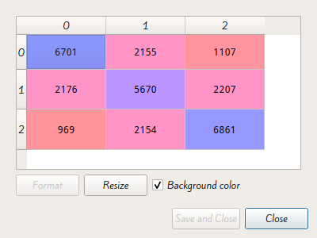
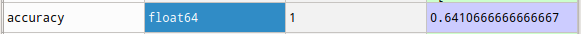
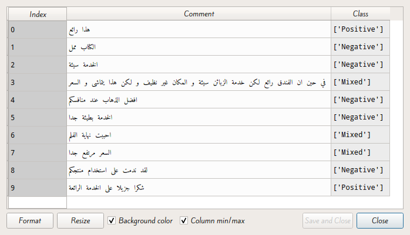

<div style="text-align:center;font-size:30px">﷽</div>


<div>
<div style="text-align:center;font-size:48px">Arabic NLP</div>
<div style="text-align:center;font-size:35px">Analyse des sentiments pour les commentaires arabes
</div>
</div>


------

# Introduction

Dans ce qui suit on va essayer de construire un modèle qui classifie des commentaires (en arabe) sur un produit donné en 3 classes:

+  **Positive**: Cette classe contiens les commentaires jugées positive sur le produit.
+  **Négatives**: Cette classe contiens le commentaires jugées négatives sur le produit.
+  **Mixed**: Cette classe contiens les commentaires qui sont objectives (Contiens des points positives et des points négatives)

Pour faire la classification on va utiliser l'algorithme **Naïve Bayes** qui un classificateur probabiliste basé sur le *théorème de bayes*. Cette méthode est parmi les méthodes (classiques) les plus utilisées pour faire une analyse des sentiments ou plus généralement un traitement du langage naturel.

## Environnement de travail

### Anaconda

[Anaconda](https://www.anaconda.com/) est un utilitaire pour **Python** offrant de nombreuse fonctionnalité. Il offre par exemple la possibilité d’**installer des librairies** et de les utiliser dans ses programmes, mais aussi propose des logiciels pour **aider les développeurs** a avoir un environnement de développement complet rapidement.

### Spyder

[Spyder](https://www.spyder-ide.org/) (nommé Pydee dans ses premières versions) est un **environnement de développement** pour **Python**. **Libre** (Licence MIT) et multi plateforme, il intègre de nombreuses bibliothèques d'usage scientifique **Matplotlib**, **NumPy**, **SciPy** et **IPython**.

### Scikit-learn

[Scikit-learn](https://scikit-learn.org/stable/) est une **bibliothèque** **libre** **Python** destinée à **l'apprentissage automatique**. Elle est développée par de nombreux contributeurs notamment dans le monde académique par des instituts français d'enseignement supérieur et de recherche comme Inria et Télécom Paris. Elle comprend notamment des fonctions pour estimer des forêts aléatoires, des régressions logistiques, des algorithmes de classification, et les machines à vecteurs de support. Elle est conçue pour s'harmoniser avec d'autres bibliothèques libres Python, notamment **NumPy** et **SciPy**.

### Pandas

[Pandas](https://pandas.pydata.org/) est une **bibliothèque** écrite pour le langage de programmation **Python** permettant **la manipulation et l'analyse des données**. Elle propose en particulier des **structures de données** et des **opérations de manipulation de tableaux** numériques et de séries temporelles. Pandas est un logiciel **libre sous licence BSD**.

---


# Construction du modèle

## Phase I: Préparation de la data-set

En ce qui concerne la data-set utilisé dans cette analyse elle est disponible [ici](https://www.kaggle.com/abedkhooli/arabic-100k-reviews).

Il s'agit de 100K (99999) commentaires sur des produits différents, l'ensemble de données combine des critiques d'hôtels, de livres, de films, de produits et de quelques compagnies aériennes. 

Il a trois classes (mixte, négative et positive). La plupart ont été cartographiés à partir des notes des examinateurs, 3 étant mitigés, supérieurs à 3 positifs et inférieurs à 3 négatifs. Chaque ligne a une étiquette et un texte séparés par un onglet (tsv). 

Le texte (avis) a été nettoyé en supprimant les signes arabes et les caractères non arabes. Le jeu de données ne comporte aucun examen en double.

On veut tout d'abord importer la data-set

```python
import pandas as pd
dataset = pd.read_csv('ar_reviews_100k.tsv', sep='\t')
```

Pour que l'analyse soit de meilleure qualité il faut qu'on fasse un autre nettoyage de données ou on élimine les mots vides (**Stop Words**) qui vont falsifier notre analyse (ou dégrader les résultats)

Un mot vide est un mot non significatif figurant dans un texte. Il est tellement commun qu'il est inutile de l'inclure dans l'analyse.

Exemple de mots vides: أنا, كان, منذ, حتى, غير, و

Pour supprimer ces mots on va utiliser une liste des mots vides pour l'Arabe disponible [ici](https://sourceforge.net/projects/arabicstopwords/files/arabicstopwords0.3.zip/download).

```python
stopwords = pd.read_csv('ar_stopwords.txt', header = None)
dataset['text'] = dataset['text'].apply(lambda x: ' '.join([word for word in x.split() if word not in (stopwords)]))
```

Puis on va découper la data-set en *Features (X)* et *Labels (y)*

```python
X = dataset.iloc[:, 1].values
y = dataset.iloc[:, 0].values
```

Puis on repartie notre data-set en *Train* et *Test*

```python
from sklearn.model_selection import train_test_split
X_train, X_test, y_train, y_test = train_test_split(X, y, test_size = 0.3, random_state = 0)
```

Finalement pour faire l'analyse en utilisant l'algorithme **Naïve bayes** nous devons extraire les "**caractéristiques**'' du texte (**Feature extraction**). Pour faire il y a plusieurs approches par exemple:

+  **Term Frequency(TF) :** Cette méthode se base simplement sur le calcule des fréquences des mots dans les documents. Elle donne l'importance aux mots les plus utilisées.
+  **Inverse Document Frequency(IDF) :** Cette méthode donne l'importance aux mots rarement utilise dans les documents.
+  **Term Frequency-Inverse Document Frequency(TF-IDF):** C'est le produit de **TF** et **IDF**. Cette mesure statistique permet d'évaluer l'importance d'un terme contenu dans un document, relativement à une collection ou un corpus.

```python
from sklearn.feature_extraction.text import TfidfVectorizer
v = TfidfVectorizer()
v.max_features = 5000 # plus ce parametere est grand plus les performances sont mieux mais la phase du training devient consommatrice de la RAM
X_train = v.fit_transform(X_train).toarray()
X_test = v.transform(X_test).toarray()
```


## Phase II: Apprentissage

Maintenant après la préparation de data-set on peut facilement construire notre modèle en exécutant le code suivant:

```python
from sklearn.naive_bayes import  MultinomialNB
classifier = MultinomialNB()
classifier.fit(X_train, y_train)
```

>  #### Note:
>
>  On peut essayer en utilisant un *kernel* différent Par exemple le **Gaussian** mais en pratique le *kernel* qui donne la meilleur *accuracy* dans notre cas est le *kernel* **Multinomial**     

## Phase III: Validation

On peut essayer de tester notre modèle sur le test-set (Cross-validation) en exécutant le code suivant:

```python
y_pred = classifier.predict(X_test)
```

Par la suite on peut calculer les différentes mesures de performances de modèle par exemple:

#### La table de confusion

```python
from sklearn.metrics import confusion_matrix
cm = confusion_matrix(y_test, y_pred, labels=['Positive', 'Mixed', 'Negative'])
```



#### L'accuracy

```python
from sklearn.metrics import accuracy_score
accuracy = accuracy_score(y_test, y_pred)
```



## Phase IV: Essai

On peut aussi tester le modèle manuellement sur des commentaires réel par exemple:



---

# Conclusion

On peut encore augmenter la précision de notre modèle en éliminant d'autres mots vides et en augmentant le nombre de features utilisées (On a utilisé `5000` dans ce modèle).

Pour que ce modèle soit vraiment utile il faut investir dans la langue dialecte puisque la plupart des commentaires dans les réseaux sociaux sont écrites en dialecte ce qui limite l'utilisation du modèle.

On peut poncer aussi a construire un modèle qui analyse les sentiments des commentaires qui contient des émojis car ils sont largement utilisées dans les commentaires.

# Bibliographie et Webographie

1. https://en.wikipedia.org/wiki/Anaconda_(Python_distribution) (fr)
2. https://fr.wikipedia.org/wiki/Pandas (fr)
3. https://fr.wikipedia.org/wiki/Scikit-learn (fr)
4. https://fr.wikipedia.org/wiki/Spyder_(logiciel) (fr)
5. https://www.kaggle.com/abedkhooli/arabic-100k-reviews (en)
6. https://sourceforge.net/projects/arabicstopwords/files/arabicstopwords0.3.zip/ (en)
7. https://scikit-learn.org/stable/ (en)