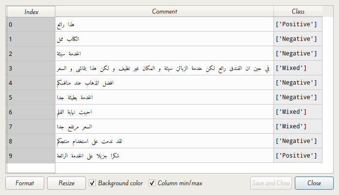

<div style="text-align:center;font-size:30px">﷽</div>


<div>
<div style="text-align:center;font-size:48px">Arabic NLP</div>
<div style="text-align:center;font-size:35px">Sentiment Analysis for Arabic Comments
</div>
</div>


Done by **Mehdi CHEBBAH**


------


# Table Of Contents

[TOC]

---

# Introduction

In what follows we will try to build a model that classifies comments (in Arabic) on a given product into 3 classes:

+ **Positive**: This class contains comments deemed positive about the product.
+ **Negatives**: This class contains comments deemed negative about the product.
+ **Mixed**: This class contains comments that are objective (Contains positive points and negative points)

To make the classification we will use the **Naïve Bayes** algorithm which is a probabilistic classifier based on the *bayes theorem*. This method is among the (classic) methods most used to perform sentiment analysis or more generally natural language processing.

## Working environment

### Anaconda

[Anaconda](https://www.anaconda.com/) is a utility for **Python** offering many features. It offers for example the possibility to **install libraries** and to use them in its programs, but also offers software to **help developers** to have a complete development environment quickly.

### Spyder

[Spyder](https://www.spyder-ide.org/) (named Pydee in its first versions) is a **development environment** for **Python**. **Free** (MIT license) and multi-platform, it integrates many libraries for scientific use **Matplotlib**, **NumPy**, **SciPy** and **IPython**.

### Scikit-learn

[Scikit-learn](https://scikit-learn.org/stable/) is a **free** **Python** library for **machine learning**. It is developed by many contributors, especially in the academic world by French higher education and research institutes like Inria and Télécom Paris. It includes functions for estimating random forests, logistic regressions, classification algorithms, and support vector machines. It is designed to harmonize with other free Python libraries, notably **NumPy** and **SciPy**.

### Pandas

[Pandas](https://pandas.pydata.org/) is a **library** written for the **Python** programming language for **data manipulation and analysis**. In particular, it offers **data structures** and **operations for manipulating numerical tables** and time series. Pandas is a **free software under BSD license**.

---


# Building the model

## Phase I: Data-set preparation

Regarding the data-set used in this analysis it is available [here](https://www.kaggle.com/abedkhooli/arabic-100k-reviews).

It is 100K (99999) reviews on different products, the dataset combines reviews of hotels, books, movies, products and some airlines. 

It has three classes (mixed, negative and positive). Most were mapped from the reviewers' ratings, with 3 being mixed, above 3 positive, and below 3 negative. Each row has a label and text separated by a tab (tsv). 

The text (notice) was cleaned by removing Arabic numerals and non-Arabic characters. There are no duplicate reviews in the dataset.

First, we want to import the data-set:

```python
import pandas as pd
dataset = pd.read_csv('ar_reviews_100k.tsv', sep='\t')
```

In order for the analysis to be of better quality, we need to do another data cleaning where we eliminate the empty words (**Stop Words**) that will falsify our analysis (or degrade the results)

A stop word is an insignificant word in a text. It is so common that it is useless to include it in the analysis.

Examples of stop words: أنا, كان, منذ, حتى, غير, و

To remove these words we will use a list of Arabic stop words available [here](https://sourceforge.net/projects/arabicstopwords/files/arabicstopwords0.3.zip/download).

```python
stopwords = pd.read_csv('ar_stopwords.txt', header = None)
dataset['text'] = dataset['text'].apply(lambda x: ' '.join([word for word in x.split() if word not in (stopwords)]))
```

Then we will split the data-set into *Features (X)* and *Labels (y)*:

```python
X = dataset.iloc[:, 1].values
y = dataset.iloc[:, 0].values
```

Then we split our data-set into *Train* and *Test*.

```python
from sklearn.model_selection import train_test_split
X_train, X_test, y_train, y_test = train_test_split(X, y, test_size = 0.3, random_state = 0)
```

+  Finally to do the analysis using the **Naïve bayes** algorithm we need to extract the "**features**" of the text (**Feature extraction**). To do this there are several approaches for example:

+ **Term Frequency(TF):** This method is simply based on the calculation of word frequencies in documents. It gives importance to the most used words.
+  **Inverse Document Frequency(IDF) :** This method gives importance to words rarely used in documents.
+  **Term Frequency-Inverse Document Frequency(TF-IDF):** This is the product of **TF** and **IDF**. This statistical measure evaluates the importance of a term contained in a document, relative to a collection or a corpus.

```python
from sklearn.feature_extraction.text import TfidfVectorizer
v = TfidfVectorizer()
v.max_features = 5000 # plus ce parametere est grand plus les performances sont mieux mais la phase du training devient consommatrice de la RAM
X_train = v.fit_transform(X_train).toarray()
X_test = v.transform(X_test).toarray()
```


## Phase II: Training

Now after the preparation of the data-set we can easily build our model by running the following code:

```python
from sklearn.naive_bayes import  MultinomialNB
classifier = MultinomialNB()
classifier.fit(X_train, y_train)
```

>  #### Note:
>
>  We can try using a different *kernel* For example the **Gaussian** but in practice the *kernel* that gives the best *accuracy* in our case is the **Multinomial** *kernel*.

## Phase III: Validation

We can try to test our model on the test-set (Cross-validation) by running the following code:

```python
y_pred = classifier.predict(X_test)
```

Then we can calculate the different measures of model performance for example:

### The confusion matrix

```python
from sklearn.metrics import confusion_matrix
cm = confusion_matrix(y_test, y_pred, labels=['Positive', 'Mixed', 'Negative'])
```


### The accuracy

```python
from sklearn.metrics import accuracy_score
accuracy = accuracy_score(y_test, y_pred)
```


## Phase IV: Trial

You can also test the model manually on real comments for example:



---

# Conclusion

We can further increase the accuracy of our model by eliminating more empty words and increasing the number of features used (we used `5000` in this model).

For this model to be really useful we need to invest in the dialect language since most comments in social networks are written in dialect which limits the use of the model.

We can also try to build a model that analyzes the sentiments of comments that contain emojis since they are widely used in comments.

# Bibliography & Webography

1. https://en.wikipedia.org/wiki/Anaconda_(Python_distribution) (fr)
2. https://fr.wikipedia.org/wiki/Pandas (fr)
3. https://fr.wikipedia.org/wiki/Scikit-learn (fr)
4. https://fr.wikipedia.org/wiki/Spyder_(logiciel) (fr)
5. https://www.kaggle.com/abedkhooli/arabic-100k-reviews (en)
6. https://sourceforge.net/projects/arabicstopwords/files/arabicstopwords0.3.zip/ (en)
7. https://scikit-learn.org/stable/ (en)